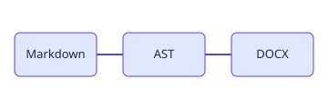

# Quilldown Smoke Test

This sample exercises the Markdown features quilldown maps into native Word constructs.
It is used by the round-trip test and as a quick manual check.

## Text and inline formatting

Quilldown renders **bold**, *italic*, ***bold italic***, `inline code`, and
~~strikethrough~~ text. Long paragraphs wrap naturally and a footnote reference sits
here.[^fidelity]

## Lists

Unordered:

- First bullet
- Second bullet
  - Nested bullet
- Third bullet

Ordered:

1. Parse Markdown with comrak
2. Walk the AST
3. Emit OOXML with docx-rs

Task list:

- [x] Headings
- [x] Tables
- [ ] Native hyperlinks

## A table

| Feature      | Markdown        | Word target            |
|--------------|-----------------|------------------------|
| Heading      | `#` / `##`      | Heading1 / Heading2    |
| Bold         | `**text**`      | bold run               |
| Code block   | fenced block    | shaded monospace       |
| Footnote     | `[^id]`         | native Word footnote   |

## A code block

```rust
fn main() {
    println!("Hello from quilldown!");
}
```

## A diagram



[^fidelity]: High fidelity means Markdown features survive into native Word constructs
    (styles, tables, numbering, footnotes) rather than being flattened into plain text.
